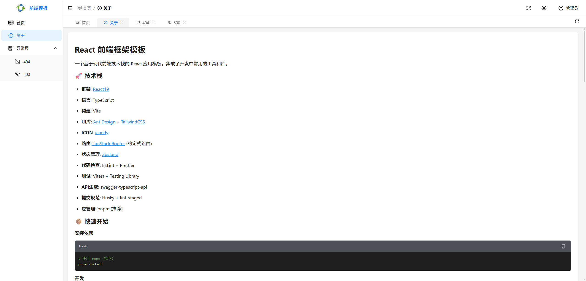

# 协鑫数智 React 前端框架模板

一个基于现代前端技术栈的 React 应用模板，集成了开发中常用的工具和库。

[预览地址](http://180.213.184.31:8087)

## 产品截图




## 🚀 技术栈

- **框架**: [React19](https://react.dev/learn)
- **语言**: TypeScript
- **构建**: Vite
- **UI库**: [Ant Design](https://ant.design/components/overview-cn/) + [TailwindCSS](https://tailwindcss.com)
- **ICON**: [iconify](https://icon-sets.iconify.design)
- **路由**:[ TanStack Router](https://tanstack.com/router/latest) (约定式路由)
- **状态管理**: [Zustand](https://zustand.docs.pmnd.rs/getting-started/introduction)
- **代码检查**: ESLint + Prettier
- **测试**: Vitest + Testing Library
- **API生成**: swagger-typescript-api
- **提交规范**: Husky + lint-staged
- **包管理**: pnpm (推荐)

## 📦 快速开始

### 安装依赖

```bash
# 使用 pnpm (推荐)
pnpm install
```

### 开发

```bash
pnpm run dev
```

### 构建

```bash
pnpm run build
```

### 测试

```bash
# 运行测试
pnpm run test

# 测试覆盖率
pnpm run test:coverage

# 测试UI界面
pnpm run test:ui
```

### 代码检查和格式化

```bash
# ESLint检查
pnpm run lint

# ESLint自动修复
pnpm run lint:fix

# Prettier格式化
pnpm run format
```

### API代码生成

```bash
# 从生成API代码
pnpm run gen-api
```

## 📁 项目结构

```tree
scripts/            # 脚本文件


src/
├─assets            # 静态资源
├─routes            # 路由页面(约定式路由)
├─api               # API相关文件
├─components        # 可复用组件
│  └─__tests__
├─constants         # 常量
├─hooks             # 自定义Hooks
├─ utils            # 实用工具
├─store             # Zustand状态管理
├─test
└─ main.tsx       # 应用入口
```

## 🛠️ 开发指南

### 路由

使用 TanStack Router 的约定式路由：

- `src/routes/index.tsx` → `/`
- `src/routes/about.tsx` → `/about`
- `src/routes/users/index.tsx` → `/users`
- `src/routes/users/$id.tsx` → `/users/:id`

### 状态管理

使用 Zustand 进行状态管理，示例：

```typescript
import { useAppStore } from '@/store/useAppStore'

function MyComponent() {
  const { count, increment } = useAppStore()
  return <button onClick={increment}>{count}</button>
}
```

## 🔧 配置说明

- **ESLint**: 代码质量检查，配置在 `eslint.config.js`
- **Prettier**: 代码格式化，配置在 `.prettierrc`
- **TailwindCSS**: 样式框架，配置在 `tailwind.config.js`
- **Vitest**: 测试框架，配置在 `vitest.config.ts`
- **Husky**: Git hooks，配置在 `.husky/`

## 📚 开发规范

- .tsx单文件注意点：
  - 单个文件行数300行以内
  - 每个文件只导出一个组件或函数
  - 组件文件名使用大驼峰命名法
  - 函数文件名使用小驼峰命名法

```typescript
import { Button } from 'antd'
// 顶层导入外部函数或组件，然后空行导入项目函数或组件
import { useAppStore } from '@/store/useAppStore'

function MyComponent() {
  const { count, increment } = useAppStore()
  return <Button onClick={increment}>{count}</Button>
}
```

## 📝 提交规范

遵循 [Conventional Commits](<[conventionalcommits](https://www.conventionalcommits.org/)>) 规范的提交信息 。若新建项目没有 .git 目录，执行 **_git init_** 后

```bash
# 非必需
npx gitmoji -i
```

项目使用 **_Husky_** 和 **_lint-staged_** 确保代码质量：

- 提交前自动运行 **_ESLint_** 和 **_Prettier_**
- 建议使用约定式提交格式：
  - `✨feat: 新功能`
  - `🐛fix: 修复bug`
  - `📝docs: 文档更新`
  - `🎨style: 代码格式`
  - `♻️refactor: 重构`
  - `✅test: 测试`
  - `⚡️perf: 性能优化`
  - `🔧chore: 构建过程或辅助工具的变动`
  - `🚀ci: 构建系统或脚本更改`
